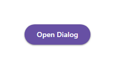

# @banegasn/m3-dialog



Material Design 3 modal dialog web component built with Lit. `m3-dialog` is a self-contained, keyboard-safe modal primitive: it does not require a framework dialog service.

## Installation

```bash
pnpm add @banegasn/m3-dialog
```

```js
import '@banegasn/m3-dialog';
```

## Basic usage

```html
<button id="open">Delete item</button>

<m3-dialog id="delete-dialog" headline="Delete item">
  <p>This action cannot be undone.</p>
  <button slot="actions" id="cancel">Cancel</button>
  <button slot="actions" id="confirm">Delete</button>
</m3-dialog>

<script type="module">
  const dialog = document.querySelector('#delete-dialog');
  document
    .querySelector('#open')
    .addEventListener('click', () => dialog.show());
  document
    .querySelector('#cancel')
    .addEventListener('click', () => dialog.close('action'));
  document
    .querySelector('#confirm')
    .addEventListener('click', () => dialog.close('action'));
</script>
```

Action slots do not close the dialog automatically. Explicitly calling `close('action')` makes the completed action observable and lets the application decide what each action means.

## Modal contract

When open, the component:

- Moves focus to an `[autofocus]` descendant, otherwise the first focusable descendant (including controls in slotted content and open component shadow roots).
- Wraps Tab and Shift+Tab within the topmost dialog. If there are no focusable descendants, the dialog surface itself receives focus.
- Uses the native `<dialog>` top layer, so visual and pointer-event stacking follows open order even when dialogs originate in different DOM or CSS stacking contexts.
- Uses the platform `inert` property on background sibling branches up to `body` and locks document scrolling. Original inert and overflow values are restored after the final dialog closes.
- Handles Escape and scrim clicks only for the topmost dialog. Both become cancelable close requests.
- Restores focus to the element that opened the dialog when it is still connected. Removed openers are safely ignored.

Multiple open dialogs are supported; only the most recently opened dialog owns focus and keyboard dismissal. The component uses the platform `inert` primitive and does not bundle an inert polyfill.

## Accessible naming

`headline` creates an internal heading and connects it with `aria-labelledby`. Non-empty default-slot content is connected with `aria-describedby`. Neither ARIA attribute is emitted when there is no corresponding value.

Use the canonical ARIA attributes when your application owns the label or description elsewhere:

```html
<h2 id="invite-title">Invite collaborator</h2>
<p id="invite-help">They will receive an email invitation.</p>

<m3-dialog aria-labelledby="invite-title" aria-describedby="invite-help">
  <button>Send invitation</button>
</m3-dialog>
```

An explicit `aria-labelledby` or `aria-describedby` overrides the generated relationship.

## Close lifecycle

Use `requestClose(reason)` or `close(reason)` to get cancelable close behavior. The available reasons are `"escape"`, `"scrim"`, `"action"`, and `"programmatic"`.

```js
dialog.addEventListener('dialog-request-close', (event) => {
  if (event.detail.reason === 'scrim' && formIsDirty()) {
    event.preventDefault();
  }
});

dialog.addEventListener('dialog-close', (event) => {
  console.log(`Closed via ${event.detail.reason}`);
});
```

Changing `open` to `false` is supported for declarative framework bindings and reports a `"programmatic"` `dialog-close`; use `close()` when the close must be cancelable.

## API

### Properties

| Property / attribute                   | Type             | Default | Description                                                            |
| -------------------------------------- | ---------------- | ------- | ---------------------------------------------------------------------- |
| `open`                                 | `boolean`        | `false` | Whether the dialog is modal and visible.                               |
| `headline`                             | `string`         | `''`    | Generated visible heading and accessible name.                         |
| `closeOnScrim` / `close-on-scrim`      | `boolean`        | `true`  | Allows a scrim click to request a close.                               |
| `closeOnEscape` / `close-on-escape`    | `boolean`        | `true`  | Allows Escape to request a close.                                      |
| `ariaLabelledBy` / `aria-labelledby`   | `string \| null` | `null`  | External label ID; overrides the generated heading relationship.       |
| `ariaDescribedBy` / `aria-describedby` | `string \| null` | `null`  | External description ID; overrides the generated content relationship. |

HTML boolean attributes are presence-based. To disable scrim or Escape dismissal from markup-driven code, set the matching DOM property (for example `dialog.closeOnScrim = false`).

### Methods

| Method                           | Description                                                                                         |
| -------------------------------- | --------------------------------------------------------------------------------------------------- |
| `show()`                         | Opens the dialog and resolves after Lit renders the open state.                                     |
| `close(reason = 'programmatic')` | Dispatches a cancelable close request and closes if it is accepted. Returns whether it closed.      |
| `requestClose(reason)`           | Same close-request path when the caller wants its intent to be explicit. Returns whether it closed. |

### Events

| Event                  | Detail       | Description                                                                   |
| ---------------------- | ------------ | ----------------------------------------------------------------------------- |
| `dialog-open`          | `{ opener }` | Fired after the dialog enters the modal stack.                                |
| `dialog-request-close` | `{ reason }` | Bubbles, is composed and cancelable. Prevent default to keep the dialog open. |
| `dialog-close`         | `{ reason }` | Bubbles and is composed after the dialog closes.                              |

### Slots

| Slot      | Description                                   |
| --------- | --------------------------------------------- |
| Default   | Dialog body content.                          |
| `icon`    | Optional icon above the headline.             |
| `actions` | Controls aligned at the bottom of the dialog. |

### CSS custom properties

| Property                                | Default   | Description           |
| --------------------------------------- | --------- | --------------------- |
| `--md-sys-color-surface-container-high` | `#ece6f0` | Dialog background.    |
| `--md-sys-color-on-surface`             | `#1d1b20` | Heading color.        |
| `--md-comp-dialog-container-shape`      | `28px`    | Dialog border radius. |

## Framework bindings

Frameworks can bind `open` declaratively and listen for the composed close notification. For close actions, call the dialog method with a reason rather than only setting the bound state.

```html
<!-- Angular -->
<m3-dialog [open]="isOpen" headline="Confirm" (dialog-close)="isOpen = false">
  <p>Are you sure?</p>
  <button slot="actions" (click)="dialog.close('action')">Confirm</button>
</m3-dialog>
```

```jsx
// React
<m3-dialog
  open={isOpen}
  headline="Confirm"
  ondialog-close={() => setOpen(false)}
/>
```

## License

MIT
