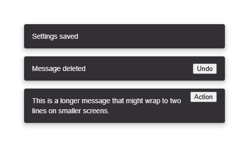

# @banegasn/m3-snackbar



Material Design 3 Snackbar web component with expressive entrance/exit animations.

## Features

- **Auto-dismiss**: Configurable duration with `duration` property (default: 4000ms)
- **Action slot**: Optional action button with click handling
- **Entrance/exit animations**: Smooth slide-up and scale transitions
- **Two-line support**: For longer messages
- **Programmatic API**: `show()` and `dismiss()` methods with observable dismissal reasons
- **Accessible**: ARIA live regions and proper roles

## Installation

```bash
npm install @banegasn/m3-snackbar
```

## Usage

```html
<script type="module">
  import '@banegasn/m3-snackbar';
</script>

<!-- Basic snackbar -->
<m3-snackbar open>Settings saved</m3-snackbar>

<!-- With action -->
<m3-snackbar open>
  Message deleted
  <button slot="action">Undo</button>
</m3-snackbar>

<!-- Two-line -->
<m3-snackbar open lines="2">
  This is a longer message that might wrap to two lines on smaller screens.
  <button slot="action">Action</button>
</m3-snackbar>

<!-- Programmatic control -->
<m3-snackbar id="snack" duration="3000">Hello!</m3-snackbar>
<script>
  document.getElementById('snack').show();
</script>
```

## CDN Usage (no build step)

```html
<!DOCTYPE html>
<html lang="en">
  <head>
    <meta charset="UTF-8" />
    <title>M3 Snackbar Demo</title>
    <script
      type="module"
      src="https://cdn.jsdelivr.net/npm/@banegasn/m3-snackbar/+esm"
    ></script>
    <style>
      body {
        font-family: Roboto, sans-serif;
        padding: 32px;
        background: #fef7ff;
      }
      .col {
        display: flex;
        flex-direction: column;
        gap: 16px;
        max-width: 400px;
      }
    </style>
  </head>
  <body>
    <div class="col">
      <m3-snackbar open>Settings saved</m3-snackbar>
      <m3-snackbar open>
        Message deleted
        <button slot="action">Undo</button>
      </m3-snackbar>
      <m3-snackbar open lines="2">
        This is a longer message that might wrap to two lines on smaller
        screens.
        <button slot="action">Action</button>
      </m3-snackbar>
    </div>
  </body>
</html>
```

## Events

- `snackbar-dismiss` - Fired exactly once for each dismissed lifecycle, after its exit animation completes. Its `detail` is `{ reason }`, where `reason` is one of:
  - `timeout` - the auto-dismiss timer elapsed
  - `action` - the action content was clicked
  - `programmatic` - `dismiss()` or a direct `open = false` closed it
  - `replacement` - `show()` was called while an open snackbar was not leaving
- `snackbar-action` - Fired when the action button is clicked

## Lifecycle contract

`open` stays true while `dismiss()` plays the exit animation and changes to false when that animation ends (immediately when reduced motion disables it). Calling `show()` during the exit cancels that exit and leaves the snackbar open; it does not emit a dismissal event. Calling `show()` while already open replaces the current lifecycle, emits `replacement`, and restarts auto-dismiss.

Changing `duration` while an open snackbar is not leaving restarts auto-dismiss from the time of the change. A duration change during exit does not alter the in-progress dismissal. Disconnecting the element clears its timer and cancels any exit listener; reconnecting an open snackbar starts a new full duration.

## License

MIT
