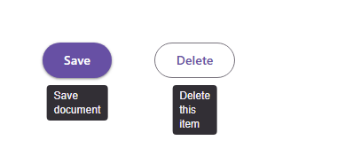

# @banegasn/m3-tooltip




> Material Design 3 Tooltip web component — framework-agnostic, built with Lit.

[](https://www.npmjs.com/package/@banegasn/m3-tooltip)
[](../../LICENSE)

An accessible **M3 Tooltip** web component following the [Material Design 3 tooltip specifications](https://m3.material.io/components/tooltips/overview). It supports descriptive plain tooltips and interactive rich tooltips with viewport-aware positioning. Works in Angular, React, Vue, Svelte, or plain HTML — no build step required.

## Features

- Plain and rich tooltip variants
- Preferred placement with viewport-edge flipping
- Hover and keyboard-focus triggers with a generated `aria-describedby` relationship
- Escape dismissal that leaves trigger focus in place
- Interactive rich tooltip content
- Framework-agnostic custom element

## Installation

```bash
npm install @banegasn/m3-tooltip
# or
pnpm add @banegasn/m3-tooltip
# or
yarn add @banegasn/m3-tooltip
```

## CDN Usage (no build step)

```html
<!DOCTYPE html>
<html lang="en">
<head>
  <meta charset="UTF-8" />
  <title>M3 Tooltip Demo</title>
  <script type="module" src="https://cdn.jsdelivr.net/npm/@banegasn/m3-tooltip/+esm"></script>
  <script type="module" src="https://cdn.jsdelivr.net/npm/@banegasn/m3-button/+esm"></script>
  <style>
    body { font-family: Roboto, sans-serif; padding: 80px 64px; background: #fef7ff; display: flex; gap: 48px; align-items: center; min-width: 350px; }
  </style>
</head>
<body>
  <!-- Plain tooltip -->
  <m3-tooltip text="Save document">
    <m3-button variant="filled">Save</m3-button>
  </m3-tooltip>

  <!-- Tooltip with bottom placement and a 300ms hover delay -->
  <m3-tooltip text="Delete this item" placement="bottom" delay="300">
    <m3-button variant="outlined">Delete</m3-button>
  </m3-tooltip>

</body>
</html>
```

## npm Usage

```js
import '@banegasn/m3-tooltip';
```

```html
<!-- Wrap any element -->
<m3-tooltip text="Helpful hint">
  <button>Hover me</button>
</m3-tooltip>
```

## API

### Properties

| Property | Type | Default | Description |
|----------|------|---------|-------------|
| `text` | `string` | `''` | Plain tooltip text |
| `variant` | `'plain' \| 'rich'` | `'plain'` | Plain descriptive tooltip or interactive rich tooltip |
| `placement` | `'top' \| 'bottom' \| 'left' \| 'right'` | `'top'` | Preferred position; flips when it would overflow the viewport |
| `delay` | `number` | `500` | Pointer-hover show delay in milliseconds; keyboard focus shows immediately |

### Slots

| Slot | Description |
|------|-------------|
| (default) | The single trigger element. Its `aria-describedby` receives the generated tooltip ID. |
| `title` | Rich-tooltip heading. Use with `variant="rich"`. |
| `content` | Rich-tooltip body and optional interactive content. Use with `variant="rich"`. |

## Rich tooltip

Rich tooltips use a dialog surface so links, buttons, and other controls remain usable. Moving between the trigger and the rich surface, or focusing content inside it, keeps it open. Pressing <kbd>Escape</kbd> dismisses either variant without moving focus.

```html
<m3-tooltip variant="rich" placement="right">
  <button aria-label="More details">Details</button>
  <strong slot="title">Storage limit</strong>
  <span slot="content">You have 2 GB remaining. <a href="/storage">Manage storage</a></span>
</m3-tooltip>
```

## Trigger ownership

`m3-tooltip` owns exactly one direct, un-slotted element child as its trigger. It adds its stable generated ID to that element’s `aria-describedby` list and removes only its own ID when the trigger changes or the tooltip disconnects. This keeps existing ID references intact.

### CSS Custom Properties

| Property | Default | Description |
|----------|---------|-------------|
| `--md-sys-color-inverse-surface` | `#322f35` | Tooltip background |
| `--md-sys-color-inverse-on-surface` | `#f5eff7` | Tooltip text color |
| `--md-comp-tooltip-shape` | `4px` | Tooltip border radius |

## Framework Usage

### Angular
```typescript
import '@banegasn/m3-tooltip';
```
```html
<m3-tooltip text="Edit item">
  <m3-button icon-only aria-label="Edit">...</m3-button>
</m3-tooltip>
```

### React
```jsx
import '@banegasn/m3-tooltip';
// <m3-tooltip text="Edit item"><button>Edit</button></m3-tooltip>
```

### Vue
```vue
<m3-tooltip text="Edit item">
  <button>Edit</button>
</m3-tooltip>
```

## Resources

- [Material Design 3 Tooltips](https://m3.material.io/components/tooltips/overview)
- [GitHub Repository](https://github.com/banegasn/components)

## License

MIT
